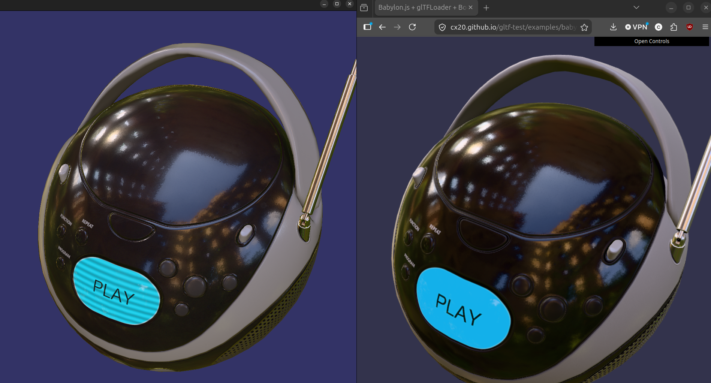

# osgGLTF

Basic glTF 2.0 mesh/texture support for OpenSceneGraph. As of 6/1/26, works for
all of the [the Khronos samples](https://github.com/KhronosGroup/glTF-Sample-Models),
with more to potentially come.

## Rendering Comparison



The screenshot compares osgGLTF's current PBR/IBL rendering against BabylonJS using
the same model and environment lighting. The goal is not pixel-perfect matching, but
matching the material response closely enough that reflections, roughness, and HDR
environment lighting behave like a modern glTF renderer should.

## Notes

This code is a patched version of the [osgEarth](https://github.com/gwaldron/osgearth/tree/master/src/osgEarthDrivers/gltf)
reference implementation. Many thanks to [Pelican
Mapping](https://www.pelicanmapping.com/) for doing 95% of the work!

Be sure and call `osgDB::Registry::instance()->addFileExtensionAlias("glb", "gltf");`
if you want to support GLB loading easily!

## CMake

A top-level build enables the KTX2 plugin, tools, examples, and installation rules by default.
Each optional layer can be controlled independently:

- `OSGGLTF_BUILD_KTX2` builds the KTX2 osgDB plugin.
- `OSGGLTF_BUILD_TOOLS` builds the CPU and GPU IBL-baking tools.
- `OSGGLTF_BUILD_EXAMPLES` builds the examples.
- `OSGGLTF_BUILD_PYTHON` builds the Python module.
- `OSGGLTF_INSTALL` generates osgGLTF installation rules.

The default top-level build enables `OSGGLTF_BUILD_TOOLS`, whose GPU prefilter tool links
`osgx::osgx`. For a fresh full build, configure, build, and install osgdebug first, then make its
installation visible while configuring osgGLTF:

```console
cmake -S . -B BUILD -DCMAKE_PREFIX_PATH=/path/to/osgdebug/prefix
```

The glTF loader itself does not currently depend on osgx. A loader-only build may therefore be
built before osgdebug by configuring with `-DOSGGLTF_BUILD_TOOLS=OFF`.

Python support also requires the location of an OpenSceneGraph.py checkout:

```console
cmake -S . -B BUILD \
	-DOSGGLTF_BUILD_PYTHON=ON \
	-DOSG_PYTHON_DIR=/path/to/OpenSceneGraph.py
```

When osgGLTF is embedded with `add_subdirectory()`, the optional layers and installation rules are
disabled by default. The glTF plugin itself remains available to the parent project.

The compiled loader can be consumed directly without going through osgDB plugin discovery:

```cmake
find_package(osgGLTF CONFIG REQUIRED)
target_link_libraries(my_target PRIVATE osgGLTF::osgGLTF)
```

```cpp
#include <osgGLTF/Reader.hpp>

osgGLTF::Reader reader;
auto result = reader.read(path, isBinary, options);
```

`osgdb_gltf` and the Python module both link this same loader target; neither recompiles the reader
implementation or instantiates its own copy of tinygltf/STB source.

## Shader Interface

osgGLTF loads geometry and materials without imposing a particular renderer. The public
`osgGLTF/Shader.hpp` header defines the attribute locations, buffer bindings, texture units,
uniform names, and canonical GLSL material declaration populated by the loader.

Custom renderers can use the GLSL declaration directly and apply the matching program setup:

```cpp
#include <osgGLTF/Shader.hpp>

auto program = new osg::Program();
auto stateSet = model->getOrCreateStateSet();

// Add shaders using osgGLTF::shader::MATERIAL_INPUTS as part of the fragment source.
osgGLTF::shader::configureProgram(*program);
osgGLTF::shader::configureStateSet(*stateSet);

stateSet->setAttributeAndModes(program);
```

`configureProgram()` maps the tangent and skinning inputs to the locations used by the loader.
`configureStateSet()` maps the material samplers to the loader's base-color, normal, ORM, and
emissive texture units. These helpers are optional; the named constants in the same header can be
used when an application needs different program or StateSet ownership.

The Python bindings expose the same constants, GLSL source, and helpers under `osgGLTF.shader`.

## GPU GGX Prefiltering

The GPU prefilter command-line tool remains packaged with osgGLTF for now, while its generic
implementation and Python bindings live in osgx:

```bash
osggltf-iblbake-gpu input.hdr output.ktx2 --prefilter-size 128
```

Applications can consume the same frame-driven scene/readback API through the compiled
`osgx::osgx` target:

```cpp
#include <osgx/GGXPrefilter.hpp>

osgx::ibl::GGXPrefilterOptions options;
options.prefilterSize = 128;

auto scene = osgx::ibl::createGGXPrefilterScene(equirectImage, options);
```

Attach `scene.root` and `scene.readback` to the caller-owned viewer as described in
`GGXPrefilter.hpp`, render until readback completes, then call
`osgx::ibl::finishGGXPrefilter()`. The result is an `osg::TextureCubeMap` containing the full
GGX-prefiltered mip chain.

For CMake package consumption:

```cmake
find_package(osgx CONFIG REQUIRED)
target_link_libraries(my_target PRIVATE osgx::osgx)
```

Python exposes the same API under `osgx.ibl`, including `GGXPrefilterOptions`,
`createGGXPrefilterScene()`, `rebakeGGXPrefilterScene()`, and `finishGGXPrefilter()`.

Future work: a dynamic reflection-probe API similar in spirit to Unreal Engine's
Reflection Capture Actors and Unity's Reflection Probes. The current baker is
synchronous and bakes from an equirectangular HDR image. A later API will support
`ASYNC` capture directly from a live scene — attaching a probe to an existing viewer
and updating the prefiltered cubemap over normal render frames without stalling the
application.
